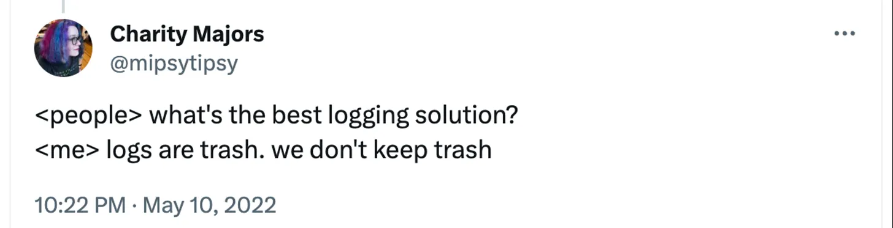

## Problem Statement: Why even need this telemetry service?



Traditional telemetry systems focus on specific metrics or narrow aspects of system performance. Every telemetry system tries to reinvent the wheel by providing
- Allow ingestion for any type of data ✅
- Custom/Opaque storage formats ❌
- DSL for querying data ❌
- Charts and graphs connected with DSL ❌
- Ability to create custom views/cubes from data and store (auto update) them ⁉️

**What do the users want?**
- Simple schema for data - ideally flat ✅
- Simple storage format - CSVs are the best ✅
- SQL for querying data  ✅
- Charts, Graphs connected with SQL ✅
- Ability to create custom views/cubes from data and store (auto update) them ✅

**What did we evaluate?**
- Posthog - everyone knows and loves
- Scuba
    - “The basic idea of Scuba is extremely simple and doesn’t require a glossary page for people to grasp. It operates with Wide Events. Wide Event is just a collection of fields with names and values, pretty much like a json document. If you need to record some information - whether it’s the current state of the system, or an event caused by an API call, background job or whatever - you can just write some Wide Event to Scuba.”[1]

**Wide Events**
As a specification, we found that “Wide telemetry events” are a perfect fit for our usecase. Wide telemetry events aim to collect a broad range of data points, providing a more comprehensive view of system behavior.

A wide telemetry event looks something like

```json
{
    "generator": "akai",
    "version": "0.0.1",
    "timestamp": "1713943647",
    "actorId": "<actor-id>",
    "actorType": "user",
    "sessionId": "<session-id>",
    "deviceId": "<device-id",
    "env": "prod",
    "eventId": "E001",
    "event": "speechToText",
    "subEvent": "receivedAudio",
    "timeElapsed": 45270,
    "botId": "550e8400-e29b-41d4-a716-446655440000",
    "orgId": "550e8400-e29b-41d4-a716-446655440000",
    "createdAt": "https://www2.cs.uic.edu/~i101/SoundFiles/BabyElephantWalk60.wav",
    "question": "How to grow wheat?"
}
```

By capturing a wide range of telemetry events, the system can provide more contextually rich insights into the performance and behavior of complex systems like BHASAI. This can help in understanding correlations, dependencies, and root causes of issues.

Wide telemetry events can be tailored to different use cases and requirements, providing greater flexibility and adaptability compared to traditional telemetry approaches. This allows organizations to capture the specific data points that are most relevant to their unique needs.

Another benefit is the Materialized view. These can store precomputed results of queries, which can significantly reduce the time and resources required to access and analyze telemetry data. This can be particularly advantageous in scenarios where real-time querying of raw telemetry data is not feasible due to performance constraints.

References
1. [Wide Events](https://isburmistrov.substack.com/p/all-you-need-is-wide-events-not-metrics)